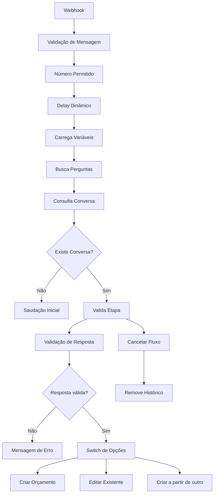

# 🤖 Automação de Atendimento WhatsApp com n8n

Este projeto contém um workflow desenvolvido no **n8n** para automação de atendimento via WhatsApp, com controle de estado de conversa, validação de respostas e execução de fluxos dinâmicos para criação e edição de orçamentos.

---

## 🚀 Visão Geral

O workflow recebe mensagens via webhook (integração com API do WhatsApp), identifica o contexto da conversa e conduz o usuário por um fluxo estruturado de atendimento.

### Principais funcionalidades:

* Recebimento de mensagens em tempo real (Webhook)
* Identificação de usuários autorizados
* Controle de estado da conversa via banco de dados (PostgreSQL)
* Simulação de digitação humana (delay dinâmico)
* Validação de respostas do usuário
* Execução de fluxos diferentes:

  * Criar orçamento
  * Editar orçamento existente
  * Criar a partir de outro orçamento
* Cancelamento de fluxo com limpeza de histórico

---

## 🧠 Arquitetura do Fluxo

---

## ⚙️ Tecnologias Utilizadas

* **n8n** → Orquestração dos fluxos
* **PostgreSQL** → Persistência de estado das conversas
* **API WhatsApp (Evolution API)** → Envio e recebimento de mensagens
* **JavaScript (Code Node)** → Regras de negócio e validações

---

## 🗂️ Estrutura da Conversa

O estado da conversa é salvo na tabela:

`conversas_chatbot`

### Campos principais:

* `conversa_id` → Identificador do usuário
* `etapa` → Etapa atual do fluxo
* `mensagem_1 ... mensagem_n` → Respostas do usuário
* `data_modificacao` → Última interação

---

## 🔄 Lógica do Fluxo

### 1. Recebimento da mensagem

* Webhook recebe evento de mensagem
* Filtra apenas mensagens válidas (não enviadas pelo próprio sistema)

### 2. Controle de acesso

* Verifica se o número está autorizado

### 3. Delay inteligente

* Calcula tempo de resposta baseado no tamanho da mensagem
* Simula comportamento humano

### 4. Persistência de estado

* Consulta se já existe uma conversa ativa
* Decide se inicia ou continua fluxo

### 5. Validação de resposta

* Valida entrada do usuário (ex: opções 1, 2, 3)
* Retorna erro em caso de entrada inválida

### 6. Roteamento de fluxo

Com base na resposta:

* Criar novo orçamento
* Editar existente
* Criar baseado em outro

### 7. Cancelamento

* Usuário pode digitar "cancelar"
* Remove estado da conversa
* Encerra fluxo

---

## 🧪 Diferenciais Técnicos

* 🔹 Controle de estado manual (sem depender de IA)
* 🔹 Arquitetura modular com sub-workflows
* 🔹 Validação dinâmica baseada em regras
* 🔹 Simulação de comportamento humano (UX melhorado)
* 🔹 Estrutura escalável para múltiplos fluxos

---

## 📌 Possíveis melhorias

* Integração com IA para interpretação de linguagem natural
* Interface administrativa para acompanhar conversas
* Sistema de logs estruturado
* Retry automático em falhas de API

---

## 👨‍💻 Autor

Victor Maximo
Desenvolvedor Fullstack com foco em automações, integrações e sistemas escaláveis.

---

## 📎 Observação

Este workflow representa um caso real de uso em ambiente de produção, adaptado para fins de portfólio.
